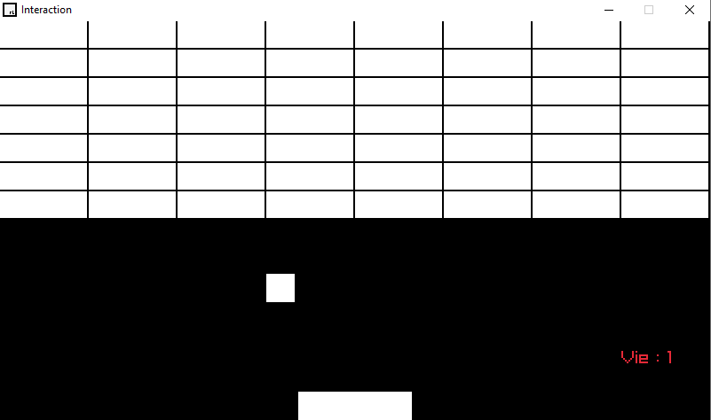

# Brick_Breaker
🧱🎮🏗️In Brick Breaker, you control a paddle to bounce a ball and break bricks. The goal is to clear all bricks from the screen. 

# 🧱🚀🕹️ Casse-briques

## Table des matières
- Comment installer ?
  - Windows
  - Linux
- Présentation du code
  - Intelligence Artificielle (IA)
  - Sons

## *Comment installer ?*

### Windows :

Cloner le repo et lancer simplement l'executable `Main.exe`

### Linux :

Juste plus long mais tout aussi simple :

- Ouvrir un terminal 
- Installer raylib <br>
Assurez-vous d'avoir les droits d'administration (sudo) pour installer les dépendances nécessaires. Cette commande effectuera toutes les étapes d'installation de raylib et exécutera l'exemple `core_basic_window` à la fin.

> Note: Si vous utilisez un autre compilateur que gcc, veuillez adapter la commande en conséquence.

Après l'exécution de la commande, vous aurez un exécutable généré incluant raylib. Vous pouvez ensuite exécuter cet exécutable en utilisant `./executable`.<br><br>
```bash sudo apt update && sudo apt install -y build-essential cmake git libasound2-dev libpulse-dev libaudio-dev libx11-dev libxrandr-dev libxcursor-dev libxi-dev libgl1-mesa-dev libglu1-mesa-dev && git clone https://github.com/raysan5/raylib.git && cd raylib && cmake . && make && sudo make install && cd examples && make && ./core_basic_window. ```

- Compiler et executer le main : <br> <br>`g++ Main.cpp -o casse_briques -lraylib -lGL -lm -lpthread -ldl -lrt -lX11 && ./casse_briques` <br>


# *Maintenant Jouer !*

Voici a quoi ressemble le jeu : 

<p align="center"></p>


# Présentation du code

*Ceci est une brève présentation du code de mon jeu interactif. Pour plus de détails, veuillez consulter le fichier source complet ou me contacter.*

La section des `#include` :
- `iostream`, `string`, `vector` : bibliothèques standard de C++ utilisées pour les entrées/sorties et la manipulation de chaînes et de vecteurs.
- `cstdlib`, `ctime` : bibliothèques standard de C++ utilisées pour la gestion du temps et des fonctions aléatoires.
- `"raylib.h"` : framework raylib.

Définition des constantes :
- `LARGEUR_ECRAN` : la largeur de l'écran du jeu.
- `HAUTEUR_ECRAN` : la hauteur de l'écran du jeu.
- `vitesseRaquetteGauche` : la vitesse de déplacement de la raquette gauche.
- `vitesseRaquetteDroite` : la vitesse de déplacement de la raquette droite.
- `scoreForWin` : le score nécessaire pour gagner le jeu.

Déclaration des variables :
- `scoreJoueur`, `scoreIa` : les scores du joueur et de l'IA.
- `etatJeu` : l'état actuel du jeu.
- `vitesseBalleX`, `vitesseBalleY` : les vitesses de déplacement de la balle sur les axes X et Y.

### *Intelligence Artificielle (IA)*
L'IA est assez simple : elle suit simplement la balle. Cependant, la vitesse de déplacement de l'IA est inférieure à celle de la balle, ce qui signifie qu'elle ne pourra pas toujours atteindre la balle à temps.

### *Sons*
Les sons sont gérés grâce à la bibliothèque raylib. Ils sont joués lorsque la balle touche une raquette, lorsqu'un joueur marque un point et lorsqu'un joueur gagne le jeu.

## **Amusez-vous !**

